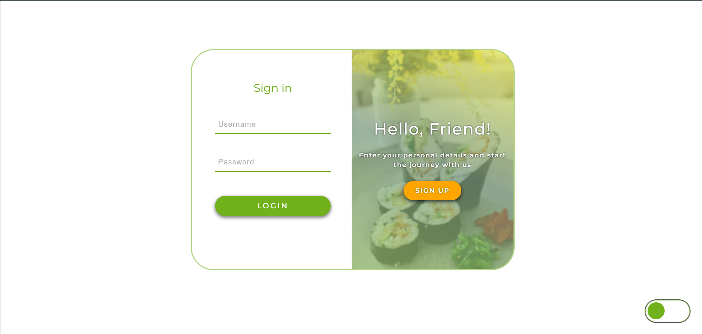
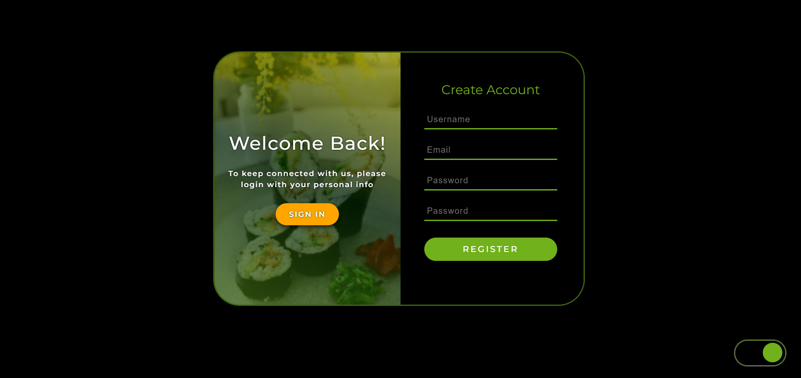

# MagicSushiLora
 

 MagicSushiLora is an online platform for recipe sharing and indulging in the world of sushi. This project focuses on building the backend with Django Rest and the front end using ReactJS, providing a user-friendly interface and functionalities for creating, browsing, and ordering sushi.

# Features
### Recipes
- MagicSushiLora allows every user to share their sushi recipes. 
- Using the Django Rest backend, users can easily add new recipes, also edit or delete them.

### Sushi Gallery
- The project includes a gallery where all users can browse various types of sushi. 
- Here, they can find inspiration and see beautiful visualizations of different recipes shared by the community.

### Learning Application
- MagicSushiLora provides a dedicated learning application that informs users about different types of sushi. 
- Here, they can learn more about each type's history, ingredients, and specifics, accompanied by photos and additional information.

### Sushi Purchase Ordering
- With a convenient sushi ordering application, users can quickly and easily select their favorite types of sushi and order them for home delivery. The process is intuitive and user-friendly.

# Technologies
- Backend: Django Rest Framework
- Frontend: ReactJS
- Database: PostgreSQL
- Authentication and Authorization: JWT (JSON Web Tokens)

# Roles and Access
## Users
### 1. Browsing Recipes:
- Users can browse all public recipes shared by other users.

### 2.Creating and Managing Personal Recipes:
- Users can create their recipes and edit, delete, or view a list.

### 3.Viewing Sushi Gallery:
- All users have access to the gallery, where they can browse various types of sushi.

### 4. Using the Learning Application:
- Users can use the learning application to learn more about different types of sushi.

### 5.Sushi Ordering:
- Users can order sushi through the dedicated ordering application.

## Administrators
### Managing Recipes and Gallery:
- Administrators can add, edit, and delete all recipes.
- They can manage content in the gallery, including adding new photos and information.

### Managing Users:
- Administrators have the right to view and manage user profiles, including their permissions.

### Monitoring Orders:
- Administrators can view and monitor user orders, ensuring smooth and efficient sushi delivery.

### Managing Content in the Learning Application:
- Administrators have the right to add, edit, and delete information from the learning application.

### System Configuration and Security:
- Administrators can perform system configurations and ensure the security of the platform.

- This role model provides adequate access and control over the functionalities of MagicSushiLora, offering complete freedom for users and efficient management for administrators.

