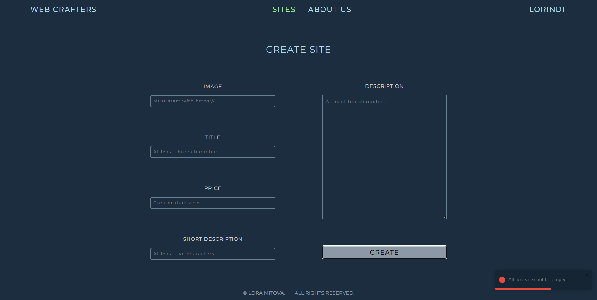
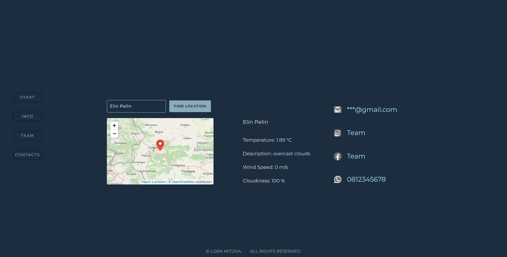
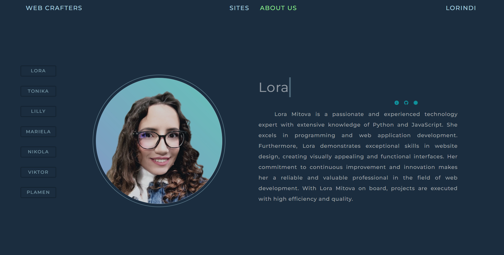

React Project - Web Crafters
Web Crafters is a Single Page Application (SPA) created using React for the Frontend and a custom backend server for the Backend.

<h1 align="center" id="title">Web Crafters</h1>

Web Crafters is a platform that allows users to create descriptions for modern and functional websites. Authenticated users can manage their sites, while others can view site details, write a comment, and learn more about the team behind the projects.

<h2>💻 Built with</h2>

# Technologies used in the project:

*   React
*   HTML, CSS 
*   JavaScript
*   Toastify
*   Node.js (custom backend server)
*   General Requirements:
*   The main part includes a sites (dashboard) for managing websites.
*   APIs:
    - Weather API: https://openweathermap.org/api
*   Fontawesome

# A guest has access to:

    * Home page
    * About us page
    * Login page
    * Register page

# An authenticated user (Web Crafter) has access to:

    * Sites page
    * Create a site
    * Editing the site
    * Delete the site
    * Create a comment on the site
    * Delete a comment on the site
    * Profile
    * Log out of your account

###########################################################################################################

# Installation:

# Clone the repository
        * git clone 'https://github.com/lorindi/My-Projects.git'
        * opened TheWizardOfWebsites in VSC

# Run application:
    * Open the terminal in the "frontend" folder and run:

        * `npm create vite .` (current folder)
        * `npm install` (or `npm i`)
        * `npm run dev`
        *  Which opens the app at http://localhost:5173 in your browser.
        
# Run Backend Server:
    * Open the terminal in the "server" folder and run:

        * cd .\server\ => node .\server.js
        * Server listening on port 3030
        * You can make requests to http://localhost:3030/
        * Admin panel located at http://localhost:3030/admin
        

Project Screenshots:

# LOGIN

 
 
 

# REGISTER

 
 
 

# CREATE SITE

 
 
 

# SITES

 
 
 

# SITE DETAILS

 
 
 

# HOME PAGE

 
 
 

# ABOUT US

Update Readme.md